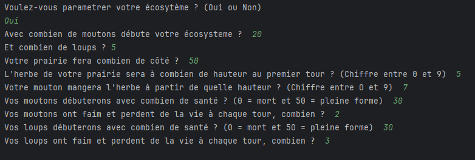
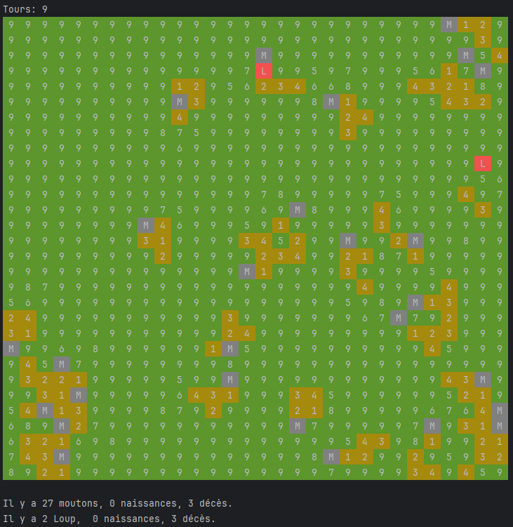

# Simulation d’un écosystème de moutons et de loups

Ce dépôt contient une simulation pédagogique développée en NSI (niveau lycée) : elle met en scène une prairie peuplée de moutons et de loups dont les interactions sont modélisées tour après tour.

## Fonctionnement de la simulation
- La prairie est représentée comme une grille où chaque case contient un niveau d’herbe compris entre 0 et 9.
- Les moutons mangent de l’herbe à chaque tour. Ils doivent atteindre un seuil minimal de nourriture pour survivre, se déplacent aléatoirement et peuvent se reproduire lorsqu’ils se retrouvent sur la même case.
- Les loups se déplacent vers le mouton le plus proche (sauf quand ils partagent une case avec un autre loup pour éviter des reproductions infinies) et doivent ingérer un nombre minimal de moutons par tour pour ne pas mourir. Ils peuvent aussi se reproduire sous certaines conditions.

## Arborescence utile
- `Ecosystème/main.py` : point d’entrée de la simulation.
- `Ecosystème/Animaux/moutons.py` et `Ecosystème/Animaux/loups.py` : comportements spécifiques à chaque espèce.
- `Base/param.py`, `Base/prairie.py`, `Base/simulation.py` : configuration des règles, gestion de la prairie et boucle principale.

## Prérequis
1. Installer Python 3.11 (ou version compatible) si ce n’est pas déjà fait.
2. Aucun paquet externe n’est requis pour le moment : le projet utilise uniquement la bibliothèque standard.

## Lancer la simulation
1. Ouvrir un terminal dans la racine du projet (où se trouve ce README).
2. Exécuter :
   ```powershell
   python Ecosystème/main.py
   ```
3. Observer la sortie dans la console : la prairie est décrite tour par tour et les événements (naissances/morts) s’affichent.

## Captures d’écran 





## Améliorations possibles
- Ajouter une interface graphique ou une visualisation animée de la prairie.
- Paramétrer davantage les règles (vitesse de déplacement, reproduction, etc.).
- Sauvegarder les statistiques de population pour analyser la stabilité de l’écosystème.

N’hésitez pas à créer vos propres variantes, à documenter vos captures et à enrichir ce README avec d’autres explications si besoin.
